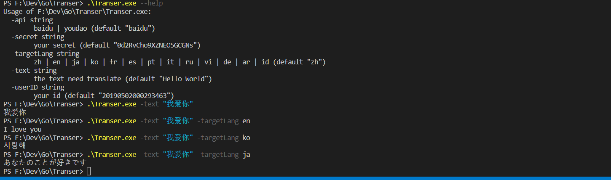
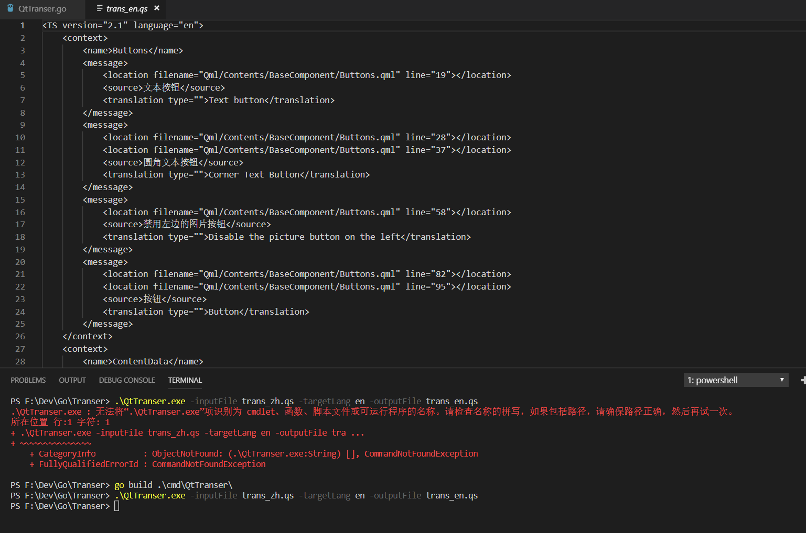

# Transer 

## 简介
golang 翻译器

目前实现了百度和有道的翻译API对接

提供了两个命令行工具:

## Transer

单条翻译，有道 只支持13国语言。



## QtTranser

Qt的多语言文件批量翻译



## Go环境

golang 1.12及以上

不需要设置环境变量

## 编译/运行

在源码目录执行go run并提供参数即可，不提供参数则显示Uasge。 例如：

```
PS E:\Dev\go\Transer> go run .\cmd\QtTranser
  -api string
        baidu | youdao (default "baidu")
  -inputFile string
        the input file need translate
  -outputFile string
        the output file (default "out.tr")
  -secret string
        your secret (default "0d2RvCho9XZNEO5GCGNs")
  -targetLang string
        zh | en | ja | ko | fr | es | pt | it | ru | vi | de | ar | id (default "zh")
  -userID string
        your id (default "20190502000293463")

```

默认userID和secret是我个人申请的有道账号，可能过期，请自行替换为百度/有道账号。

## Build status
[](https://travis-ci.org/jaredtao/Transer)
## License
[](https://github.com/jaredtao/Transer/blob/master/LICENSE)

参考资料：https://zhuanlan.zhihu.com/p/37690859
